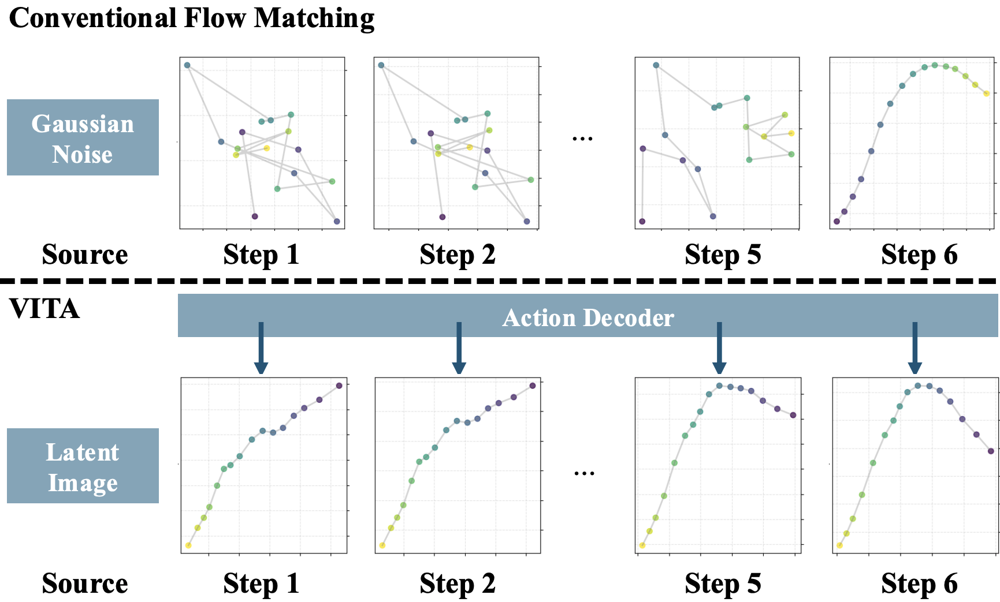
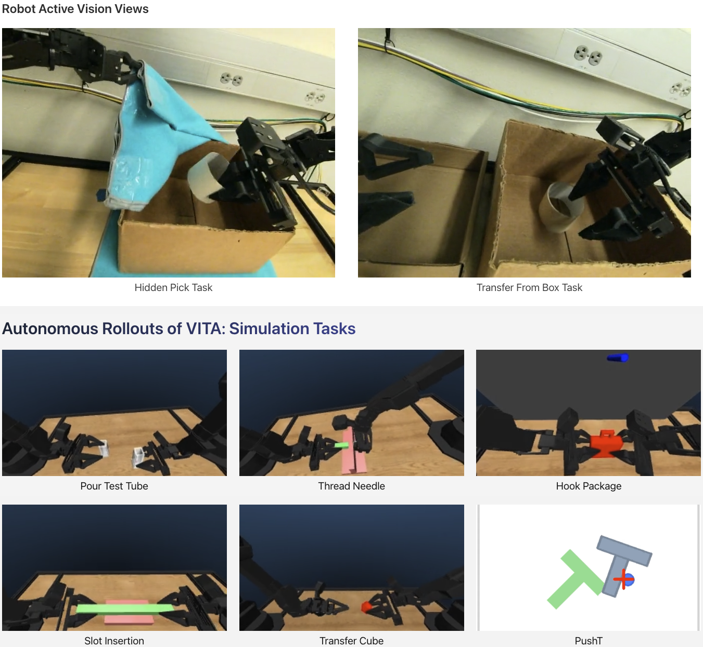

<p align="center">
  
</p>

# 🌊 VITA: Vision-to-Action Flow Matching Policy

This repository provides the official implementation of the paper **VITA: Vision-to-Action Flow Matching Policy** (July 2025).

**VITA** is a **noise-free, conditioning-free** policy learning framework that learns visuomotor policies by directly mapping latent images to latent actions.

<p align="center">
  <a href="https://ucd-dare.github.io/VITA/"></a>
  <a href="https://arxiv.org/abs/2507.13231"></a>
  <a href="https://arxiv.org/pdf/2507.13231"></a>
  
</p>

---

<p align="center">
  
</p>

---

## 🚀 Getting Started

This section covers installation, dataset preprocessing, and training.

* **Policy and training:** `./flare`
* **Simulation:** [AV-ALOHA](https://soltanilara.github.io/av-aloha/) tasks (`gym-av-aloha`) and [Robomimic](https://robomimic.github.io/) tasks (`gym-robomimic`)
* **Datasets:** Built on [LeRobot](https://github.com/huggingface/lerobot) Hugging Face formats, with optimized preprocessing into offline Zarr for faster training

---

### 🔧 Setup

```bash
git clone git@github.com:ucd-dare/VITA.git
cd VITA
conda create --name vita python==3.10
conda activate vita
conda install cmake
pip install -e .
pip install -r requirements.txt
# Install LeRobot dependencies
cd lerobot
pip install -e .
# Install ffmpeg for dataset processing
conda install -c conda-forge ffmpeg
```

Set the dataset storage path:

```bash
echo 'export FLARE_DATASETS_DIR=<PATH_TO_VITA>/gym-av-aloha/outputs' >> ~/.bashrc
# Reload bashrc
source ~/.bashrc
conda activate vita
```

Install benchmark dependencies for AV-ALOHA and/or Robomimic as needed:

* **AV-ALOHA**

```bash
cd gym-av-aloha
pip install -e .
```

* **Robomimic**

```bash
cd gym-robomimic
pip install -e .
```

---

### 📦 Dataset Preprocessing

Our dataloaders extend [LeRobot](https://github.com/huggingface/lerobot), converting datasets into offline zarr format for faster training. We host datasets on HuggingFace. To list available datasets:

```bash
# 
cd gym-av-aloha/scripts
python convert.py --ls
```

As of Sept 2025, available datasets include:

```yaml
- iantc104/av_aloha_sim_cube_transfer
- iantc104/av_aloha_sim_thread_needle
- iantc104/av_aloha_sim_pour_test_tube
- iantc104/av_aloha_sim_slot_insertion
- iantc104/av_aloha_sim_hook_package
- iantc104/robomimic_sim_transport
- iantc104/robomimic_sim_square
- iantc104/robomimic_sim_can
- lerobot/pusht
```

Convert a HuggingFace dataset (conversion may take >10 minutes) to offline zarr datasets. For example:

```bash
python convert.py -r iantc104/av_aloha_sim_hook_package
```

Datasets will be stored in `./gym-av-aloha/outputs`.

If you encounter errors with `cv2`, `numpy`, or `scipy` during the conversion, re-installing them often resolves the issue:

```bash
pip uninstall opencv-python numpy scipy
pip install opencv-python numpy scipy
```

---

### 📊 Logging

We use [WandB](https://wandb.ai/) for experiment tracking. Log in with `wandb login`, then set your entity in `./flare/configs/default_policy.yaml` (or append `wandb.entity=YOUR_ENTITY_NAME` to the training command):

```yaml
wandb:
  entity: "YOUR_WANDB_ENTITY"
```

We log: offline validation results, online simulator validation results, as well as visualizations of the ODE denoising process, which helps interpret how action trajectories evolve during ODE solving using different algorithms.

`Example:` in the first row below, VITA produces a structured action trajectory after just one ODE step, while conventional flow matching starts from Gaussian noise and gradually denoises.

<p align="center">
  
</p>

---

### 🏋️ Training

```bash
python flare/train.py policy=vita task=hook_package session=test
```

* Use `session` to name checkpoints/logs (and WandB runs).
* Default config: `./flare/configs/default_policy.yaml`
* Policy config: `./flare/configs/policy/vita.yaml`
* Task config: `./flare/configs/task/hook_package.yaml`
* These override defaults when specified, e.g. `policy=vita task=hook_package`.

Override flags as needed:

```bash
# Example 1: Use a specific GPU
python flare/train.py policy=vita task=hook_package session=test device=cuda:2

# Example 2: Change online validation frequency and episodes
python flare/train.py policy=vita task=hook_package session=test \
  val.val_online_freq=2000 val.eval_n_episodes=10

# Example 3: Run an ablation
python flare/train.py policy=vita task=hook_package session=ablate \
  policy.vita.decode_flow_latents=False wandb.notes=ablation
```

#### 🎮 Available Tasks

Available task configs are located in ./flare/config/tasks. To launch training with a specific task, set the `task` flag (e.g., `task=cube_transfer` to load `cube_transfer.yaml`).

```yaml
# AV-ALOHA tasks
cube_transfer
hook_package
pour_test_tube
slot_insertion
thread_needle
# Robomimic
robomimic_can
robomimic_square
# PushT
pusht
```

---

<p align="center">
  
</p>

---

## 🌐 Links

* 🧪 [Project Page](https://ucd-dare.github.io/VITA/)
* 📄 [arXiv Paper](https://arxiv.org/abs/2507.13231)
* 📑 [PDF](https://arxiv.org/pdf/2507.13231)

We gratefully acknowledge open-source codebases that inspired VITA:
[AV-ALOHA](https://soltanilara.github.io/av-aloha/), [Robomimic](https://robomimic.github.io/), and [LeRobot](https://github.com/huggingface/lerobot).

---

## 📖 Citation

```bibtex
@article{gao2025vita,
  title={VITA: Vision-to-Action Flow Matching Policy},
  author={Gao, Dechen and Zhao, Boqi and Lee, Andrew and Chuang, Ian and Zhou, Hanchu and Wang, Hang and Zhao, Zhe and Zhang, Junshan and Soltani, Iman},
  journal={arXiv preprint arXiv:2507.13231},
  year={2025}
}
```

---